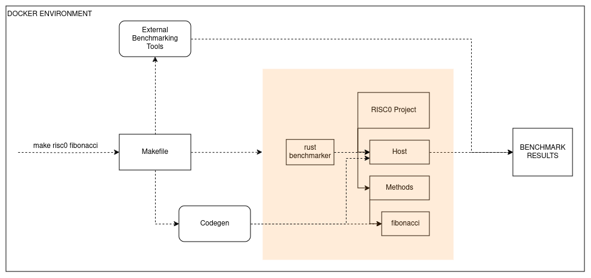
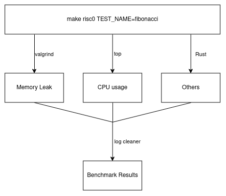

# Knowledge Bench

This project benchmarks zkVMs like RISC Zero, SP1 and Valida in isolated Docker environments. It is written with extensibility in mind, so feel free to follow the guidelines in the "Adding Tests" part to write and benchmark your own tests for the above zkVMs.

This is a final project by 3 Koc University students, done in collaboration with Chainway Labs. In the making of this project, we tried to make our code as robust and accurate as possible, but there probably still are some injustices or inefficiencies in the measurements or the picking of tests. We don't claim that our results represents the absolute objective truth, so the results should be taken with caution.

To see the results of the default tests, you can check our website at:

[WEBSITE_LINK]

## Metrics

We measure the following metrics for benchmarking during execution:
- Proving time
- Total cycles
- Peak RAM consumption during proving
- Proof size
- Verification time
- Peak RAM consumption during verification
- Total memory leak
- Total power consumption

The total power consumption is calculated by measuring the average CPU usage and multiplying it with proving time.

## Default Tests

We have the following default tests that are ready to be run for benchmarking:
- groth16
- SHA-2-256
- SHA-2-1024
- vecSum10
- vecSum100
- vecSum1000
- quickSort
- mergeSort
- RSA
- isprime
- fibonacci10
- fibonacci100
- fibonacci1000

## Benchmark Pipeline

The benchmarking process follows the below pipeline



Codegen dynamically writes the test code into the zkVM project, and then the metrics are measured using external tools and Rust packages. Then the results are cleaned using .sh files, as follows:



If it already doesn't exist, a results folder is created and the metric measurements are saved in it as explained later.

## Adding Custom Tests

//TO DO

## Requirements

Each zkVM runs in its own Docker container. Ensure `docker` is installed and configured.

## Setup

**Build Docker environments**

Build Docker environments for RISC Zero, SP1 and Valida:

```bash
bash built_docker_environments.sh
```

**Enter Docker Environments**

To run benchmarks, first enter the corresponding Docker environment.

- RISC Zero Docker Environment
```bash
docker run -it --rm -v $(pwd):/app zkvm-benchmarking-risc0 bash
```

- SP1 Docker Environment
```bash
docker run -it --rm -v $(pwd):/app zkvm-benchmarking-sp1 bash
```

- Valida Docker Environment
```bash
docker run -it --rm -v $(pwd):/app zkvm-benchmarking-valida bash
```

## Running Benchmarks

**Running Sample Tests**

Build and run a sample test in the RISC Zero Docker environment:
```bash
bash run_risc0_sample_test_in_docker.sh
```

Build and run a sample test in the SP1 Docker environment:
```bash
bash run_sp1_sample_test_in_docker.sh
```

Build and run a sample test in the SP1 Docker environment:
```bash
bash run_valida_sample_test_in_docker.sh
```

**Running RISC Zero Benchmarks**

Once inside the RISC Zero Docker environment, run:
```bash
make risc0 TEST_NAME=<test_name>
```

Example:
```bash
make risc0 TEST_NAME=vecSum10
make risc0 TEST_NAME=fibonacci
```

Results are saved in results/risc0_[TEST_NAME]_benchmark_results.txt

**Running SP1 Benchmarks**

Once inside the SP1 Docker environment, run:
```bash
make sp1 TEST_NAME=<test_name>
```

Example:
```bash
make sp1 TEST_NAME=fibTest
make sp1 TEST_NAME=isprime
```
Results are saved in results/sp1_[TEST_NAME]_benchmark_results.txt

**Running Valida Benchmarks**

Once inside the Valida Docker environment, run:
```bash
make valida TEST_NAME=<test_name>
```

Example:
```bash
make valida TEST_NAME=fibTest
make valida TEST_NAME=isprime
```
Results are saved in results/valida_[TEST_NAME]_benchmark_results.txt

**Running All Benchmarks**

Inside each Docker environment, run:
```bash
make all
```

## TO DO
- Add Valida
- Update website documentation
- Add remaning tests
- Docker integration
- Check metrics memory leak and peak RAM consumption during proving for SP1
- Add precompile support (maybe)